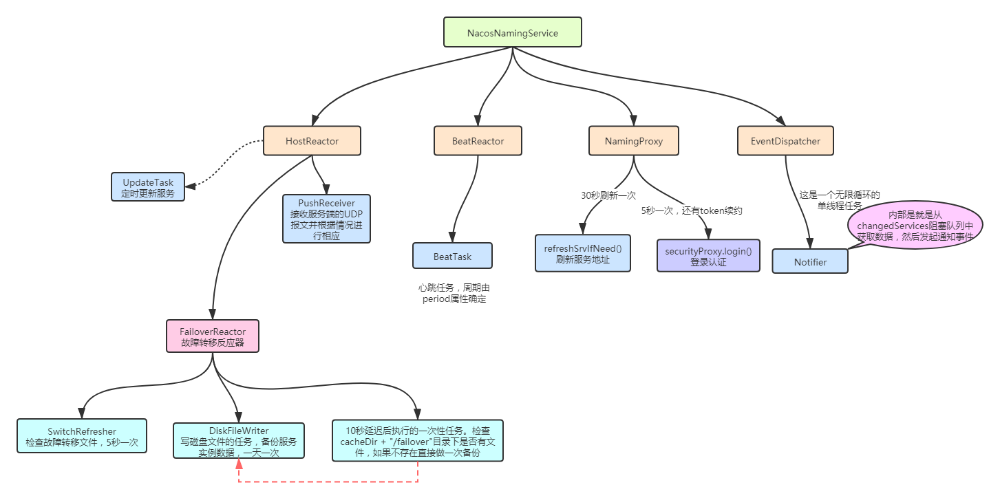

NACOS 设计

1.首先明白如下概念：

namespace 命名空间 —— 环境
group 分组 —— 项目
dataId 配置集 —— 工程

首先 Nacos 数据是存储在数据库的，不管是内置数据库，还是外置的.

参考：com.alibaba.nacos.config.server.service.repository.PersistService

关于 Nacos 如何保证数据插入到数据库在同一个事务中：将 sql 先收集起来，然后统一执行.

com.alibaba.nacos.config.server.service.repository.embedded.EmbeddedStoragePersistServiceImpl#addConfigInfo(java.lang.String, java.lang.String, com.alibaba.nacos.config.server.model.ConfigInfo, java.sql.Timestamp, java.util.Map<java.lang.String,java.lang.Object>, boolean, java.util.function.BiConsumer<java.lang.Boolean,java.lang.Throwable>)

com.alibaba.nacos.config.server.service.repository.embedded.DatabaseOperate 做数据库更新操作的.

datasource 主要是做数据库连接哪块的内容.

client 如何到 config 层的

初步结论是 client 发起 http 请求，到 com.alibaba.nacos.config.server.controller.ConfigController 中.

那 API 层是如何工作的了？

对应的是 ConfigService. 现在有一点理解了它的概念. OpenAPI 应该是为了统一接口. 实际干活的还是 configService 或者是 nameService.

com.alibaba.nacos.client.config.impl.HttpSimpleClient#httpPost(java.lang.String, java.util.List<java.lang.String>, java.util.List<java.lang.String>, java.lang.String, long, boolean)

url：http://127.0.0.1:7001/nacos/v1/cs/configs

是不是看到 com.alibaba.nacos.config.server.controller.ConfigController 这个类一脸蒙圈？

@RestController
@RequestMapping(Constants.CONFIG_CONTROLLER_PATH)
public class ConfigController {
    @PostMapping
    @Secured(action = ActionTypes.WRITE, parser = ConfigResourceParser.class)
    public Boolean publishConfig(HttpServletRequest request, HttpServletResponse response,
            @RequestParam(value = "dataId") String dataId, @RequestParam(value = "group") String group,
            @RequestParam(value = "tenant", required = false, defaultValue = StringUtils.EMPTY) String tenant,
            @RequestParam(value = "content") String content, @RequestParam(value = "tag", required = false) String tag,
            @RequestParam(value = "appName", required = false) String appName,
            @RequestParam(value = "src_user", required = false) String srcUser,
            @RequestParam(value = "config_tags", required = false) String configTags,
            @RequestParam(value = "desc", required = false) String desc,
            @RequestParam(value = "use", required = false) String use,
            @RequestParam(value = "effect", required = false) String effect,
            @RequestParam(value = "type", required = false) String type,
            @RequestParam(value = "schema", required = false) String schema) throws NacosException {

    }
    @GetMapping
    @Secured(action = ActionTypes.READ, parser = ConfigResourceParser.class)
    public void getConfig(HttpServletRequest request, HttpServletResponse response,
            @RequestParam("dataId") String dataId, @RequestParam("group") String group,
            @RequestParam(value = "tenant", required = false, defaultValue = StringUtils.EMPTY) String tenant,
            @RequestParam(value = "tag", required = false) String tag)
            throws IOException, ServletException, NacosException {

    }
}

如果一个 controller 定义了两个 PostMapping，但是又都没有配置路径是会报错的.

什么是 CMDB ？

CMDB 用于存放规模化的机器设备、应用、服务等相关的元数据。基本属性例如机器的 IP、主机名、机房、应用、所在区域等，这些元数据一般会在机器部署时录入到 CMDB.

在微服务实例进行多机房或者多地域部署时，跨地域的微服务访问往往延迟较高，一个城市内的机房间的典型网络延迟在 1ms 左右，而跨城市的网络延迟，例如南京到上海大概为 20ms。如何让服务消费者和服务提供者进行同地域访问。在实践中，此需求是通过和 CMDB 打通来实现的。在服务发现组件中，对接 CMDB，然后通过路由组件配置的访问规则，来实现服务消费者到服务提供者的同地域优先.

参考：https://cloud.tencent.com/developer/article/1751460

Nacos 如果实现 Naming Service 的功能：

参考：com.alibaba.nacos.client.naming.NacosNamingService#registerInstance(java.lang.String, java.lang.String, com.alibaba.nacos.api.naming.pojo.Instance)

name service 提供服务的订阅与注册功能，在 nacos 中，数据存储主要是基于 raft 协议.

serviceName -> Endpoints Info, Distributed Lock Name -> Lock Owner/Status Info, DNS Domain Name -> IP List.

服务发现和 DNS 就是 name service 的 2 大场景.

参考：https://blog.csdn.net/qq_19414183/article/details/112324547

关于 name server 工作原理参考：https://www.imooc.com/article/305289/

Naming service 三级结构：

https://www.jianshu.com/p/61608ff86344
https://www.liaochuntao.cn/2019/04/29/java-web-31/
https://www.jianshu.com/p/2cd487f9560a

对于 nacos-client 而言，endpoint 配置的是地址服务器的地址.

例如：

Properties properties = new Properties();
properties.setProperty(PropertyKeyConst.ENDPOINT, "{addressServerDomain}");
properties.setProperty(PropertyKeyConst.ENDPOINT_PORT, "8080");
NamingService namingService = NacosFactory.createNamingService(properties);

当 serverAddr 和 endpoint 同时存在的时候，默认是优先从地址服务器去选址.

参考：https://developer.aliyun.com/article/780760

集群和实例列表是如何对应的？

参考：
1.https://nacos.io/zh-cn/docs/architecture.html