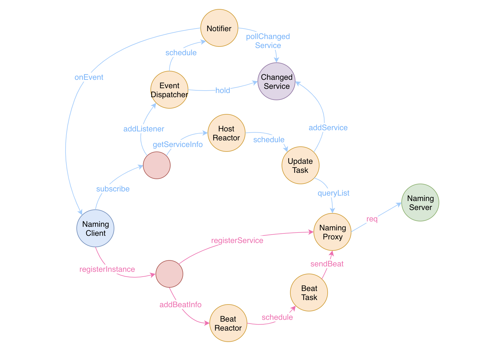

Nacos NamingServer 再分析

NamingServer 先从 @CanDistro 这个注解说起吧.

1.按服务名选择 nacos 节点，即一个服务的实例增删改，只由特定的 nacos 节点负责.

上面的描述如何理解了？

先看下如下的注解：

// 决定方法是否要重定向的注解.
@Retention(RetentionPolicy.RUNTIME)
public @interface CanDistro {
    
}

然后看下 com.alibaba.nacos.naming.web.DistroFilter#doFilter 的实现.

// 核心代码：
doFilter () {
    ...

    // 如有必要，代理请求到其他服务器.
    if (method.isAnnotationPresent(CanDistro.class) && !distroMapper.responsible(groupedServiceName)) {

        ...

        按照 hash 取模，随机选择一台服务器，然后发送请求到那一台机器上，执行，返回结果.

    } else {
        ...
    }
}

转到 com.alibaba.nacos.naming.core.DistroMapper#responsible(java.lang.String) 看下它的实现.

public boolean responsible(String serviceName) {
    final List<String> servers = healthyList;
    
    ...

    // 查看本节点位于 server 中的哪一个位置.
    // 问题：一个节点会在 servers 中存在多个？？？
    // 应该 index = lastIndex.
    // 如果计算出来的 target 正好是本机地址，那么不需要转发，直接本机处理.
    int index = servers.indexOf(EnvUtil.getLocalAddress());
    int lastIndex = servers.lastIndexOf(EnvUtil.getLocalAddress());
    if (lastIndex < 0 || index < 0) {
        return true;
    }
    
    int target = distroHash(serviceName) % servers.size();
    return target >= index && target <= lastIndex;
}

相关 pr：https://github.com/alibaba/nacos/pull/5903

上面的实现，是 nacos 上一部分 nacos server 服务一部分 client 的处理. 这个和 nacos config 的处理方式是不同的.

2.当前 nacos 节点对服务实例增删改后，会重新把数据同步给其他节点

// com.alibaba.nacos.naming.consistency.ephemeral.distro.DistroConsistencyServiceImpl#put
public void put(String key, Record value) throws NacosException {
    onPut(key, value);
    // 把同步数据的任务放入队列
    taskDispatcher.addTask(key);
}
// com.alibaba.nacos.naming.consistency.ephemeral.distro.DataSyncer#submit

--------------------------------------------------------------------------

接着看下如何注册实例的.

我们核心注意下 Distro 协议.

com.alibaba.nacos.naming.consistency.ephemeral.distro.DistroConsistencyServiceImpl#listen

我们注意到有一个 listener 集合.

putServiceAndInit -> 将 service 放入到三级结构中，init 是说加入监听. 监听的 key 是 com.alibaba.nacos.naming.iplist.(ephemeral. or '')##serviceName

然后关注下 com.alibaba.nacos.naming.consistency.ConsistencyService#put 这个方法.

在 put 方法中，会将修改封装到一个任务中去.

notifier.addTask(key, DataOperation.CHANGE);

这个通知主要是对比如 com.alibaba.nacos.naming.core.Service#onChange 等的一个回调.

我们关注下 onChange 做了什么：

问题：ServiceChangeEvent 推送什么数据？只是变更的数据？

先说明下，这个推送变更推送的是向该 nacos server 注册过监听的 nacos client 节点.

要解答这个问题，我们先看下 client 是如何添加的. see com.alibaba.nacos.naming.controllers.InstanceController#doSrvIpxt.

方法注释是：Get service full information with instances.

在最初的时候，这个最可能是在 com.alibaba.nacos.naming.controllers.InstanceController#pushDataSource 这里完成调用的.

但是没有调用如下方法：

pushService.addClient(namespaceId, serviceName, clusters, agent, new InetSocketAddress(clientIP, udpPort), pushDataSource, tid, app);

目前，发现 list url 是在 client 包下 com.alibaba.nacos.client.naming.net.NamingProxy#queryList 这个方法被调用.

为啥我感觉最新的实例修改消息无法推送到 client ？

突然间又些理解了，pushDataSource 相当于占位符，在调用 com.alibaba.nacos.naming.push.PushService#prepareHostsData 方法的时候才会调用 getData 方法，而这个 getData 方法会进一步调用如下方法：

Service service = serviceManager.getService(namespaceId, serviceName);

会重新从集群中获取信息，然后组装 instances 的信息，现在是不是很清晰了.

data 格式：

{
    "hosts": [
        {
            "ip": "11.11.11.11", 
            "port": 80, 
            "valid": true, 
            "healthy": true, 
            "marked": false, 
            "instanceId": "11.11.11.11#80#c1#group1@@jinhan5NcZT.02f3N.net", 
            "metadata": { }, 
            "enabled": true, 
            "weight": 1, 
            "clusterName": "c1", 
            "serviceName": "group1@@jinhan5NcZT.02f3N.net", 
            "ephemeral": true
        }
    ], 
    "dom": "group1@@jinhan5NcZT.02f3N.net", 
    "name": "group1@@jinhan5NcZT.02f3N.net", 
    "cacheMillis": 3000, 
    "lastRefTime": 1622449218996, 
    "checksum": "27971166d33b8630a2d5cbe33ce9ffc9", 
    "useSpecifiedURL": false, 
    "clusters": "", 
    "env": "", 
    "metadata": { }
}

先看下 com.alibaba.nacos.client.naming.NacosNamingService#subscribe(java.lang.String, java.lang.String, java.util.List<java.lang.String>, com.alibaba.nacos.api.naming.listener.EventListener) -> com.alibaba.nacos.client.naming.core.HostReactor#subscribe 注册的是 InstancesChangeEvent 事件.

向集群间的其他节点同步消息.
com.alibaba.nacos.core.distributed.distro.DistroProtocol#sync(com.alibaba.nacos.core.distributed.distro.entity.DistroKey, com.alibaba.nacos.consistency.DataOperation, long)

参考：
1.https://www.cnblogs.com/allenwas3/p/12195781.html
2.https://spring-source-code-learning.gitbook.teaho.net/cloud/nacos.html