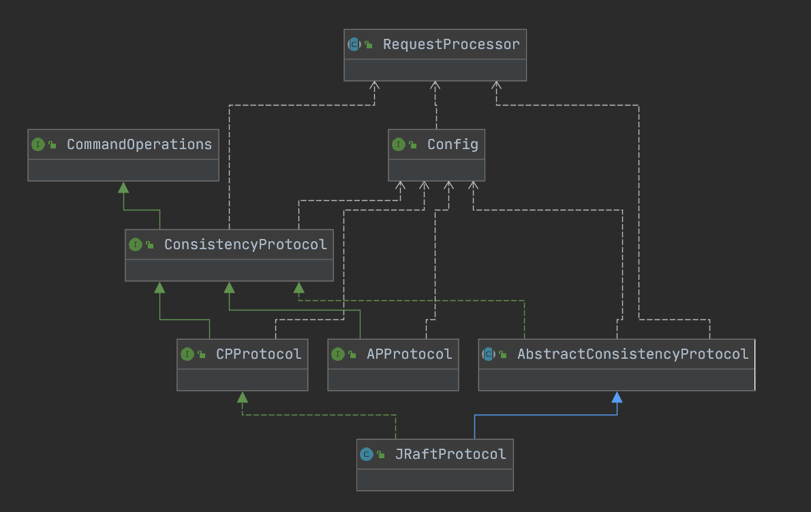

一致性，即多个副本之间是否能保持一致的特性. 而副本的本质就是数据，对数据的操作，不是获取就是修改. 同时，一致性协议其实是针对分布式情况的，所以必然会涉及多个节点. 因此，需要有相应的接口能够调整一致性协议的协同工作节点.

所以，一致性协议其实更加关注的是读、写在集群间的一致性.

ConsistencyProtocol

public interface ConsistencyProtocol<T extends Config, P extends RequestProcessor> extends CommandOperations {
    
    /**
     * Consistency protocol initialization: perform initialization operations based on the incoming.
     * Config 一致性协议初始化，根据Config 实现类
     *
     * @param config {@link Config}
     */
    void init(T config);
    
    /**
     * Add a request handler.
     *
     * @param processors {@link RequestProcessor}
     */
    void addRequestProcessors(Collection
 processors);
    
    /**
     * Copy of metadata information for this consensus protocol.
     * 该一致性协议的元数据信息
     *
     * @return metaData {@link ProtocolMetaData}
     */
    ProtocolMetaData protocolMetaData();
    
    /**
     * Obtain data according to the request.
     *
     * @param request request
     * @return data {@link Response}
     * @throws Exception {@link Exception}
     */
    Response getData(ReadRequest request) throws Exception;
    
    /**
     * Get data asynchronously.
     *
     * @param request request
     * @return data {@link CompletableFuture}
     */
    CompletableFuture<Response> aGetData(ReadRequest request);
    
    /**
     * Data operation, returning submission results synchronously.
     * 同步数据提交，在 Datum 中已携带相应的数据操作信息
     *
     * @param request {@link com.alibaba.nacos.consistency.entity.WriteRequest}
     * @return submit operation result {@link Response}
     * @throws Exception {@link Exception}
     */
    Response write(WriteRequest request) throws Exception;
    
    /**
     * Data submission operation, returning submission results asynchronously.
     * 异步数据提交，在 Datum中已携带相应的数据操作信息，返回一个Future，自行操作，提交发生的异常会在CompleteFuture中
     *
     * @param request {@link com.alibaba.nacos.consistency.entity.WriteRequest}
     * @return {@link CompletableFuture} submit result
     * @throws Exception when submit throw Exception
     */
    CompletableFuture<Response> writeAsync(WriteRequest request);
    
    /**
     * New member list .
     * 新的成员节点列表，一致性协议自行处理相应的成员节点是加入还是离开
     *
     * @param addresses [ip:port, ip:port, ...]
     */
    void memberChange(Set<String> addresses);
    
    /**
     * Consistency agreement service shut down .
     * 一致性协议服务关闭
     */
    void shutdown();
    
}

基于一致性协议之上，可以进一步抽象出 APProtocol & CPProtocol.

目前，看到只有一个 Jraft 实现了 CPProtocol.

有一个问题：AP 协议的实现 DistroProtocol 其实并没有实现 APProtocol 接口的，而是单独弄了一个，这个破坏了底层的设计.

还有一个组件值得我们注意：ConsistencyService 一致性服务. 

从注释上看，它的目标是为了将一致性服务和业务解耦，用户并不知道正在使用什么一致性服务，这样我们也为用户提供了扩展底层一致性服务的空间.

那么它和 ConsistencyProtocol 有什么区别了？

我的理解是 ConsistencyProtocol 就是底层干活的，而 ConsistencyService 是暴露给用户的. 同时 ConsistencyService 有一些不同的实现，比如基于 AP 实现的 DistroConsistencyServiceImpl，基于 CP 实现的 PersistentServiceProcessor. 这两者在底层干活的就是 Protocol.

我们重点关注下 Distro 协议.

数据存储结构：

@Component
public class DataStore {   
    private Map<String, Datum> dataMap = new ConcurrentHashMap<>(1024);
}    

这个结构表明了 Distro 协议是内存存储数据的，这一点很重要.

接着看下 Datum 的结构.

public class Datum<T extends Record> implements Serializable {
    
    private static final long serialVersionUID = -2525482315889753720L;
    
    public String key;
    
    public T value;
}

这个表明 Datum 本身是一个 key-value 的单一结构，value 是 record 类型.

目前 Record 有三个实现：

Instances 存储所有的实例信息(某个服务下的实例信息).

public class Instances implements Record {
        
    private List<Instance> instanceList = new ArrayList<>();    
}    

Service 三级结构信息(Service - Cluster - Instance). 同时需要注意的是，service 中有哦一个定时任务 clientBeatCheckTask，这个定时任务表明 nacos 是 server 和 client 双向探活的.
客户端每隔 5 秒中向服务端探活，同样的，服务端每隔 5 秒也会向客户端探活.

public class Service extends com.alibaba.nacos.api.naming.pojo.Service implements Record, RecordListener<Instances> {
    
    private static final String SERVICE_NAME_SYNTAX = "[0-9a-zA-Z@\\.:_-]+";
    
    @JsonIgnore
    private ClientBeatCheckTask clientBeatCheckTask = new ClientBeatCheckTask(this);

    private Map<String, Cluster> clusterMap = new HashMap<>();
}    

Service 还有一个需要注意的点是 RecordListener. 这是一个监听器，说明当发生变更的时候，有些监听事件要进行处理. 比如通知客户端有消息发生变更.

SwitchDomain 同样实现 Record 接口，我理解这个是一个开关.

再次回到这个 ConsistencyService.

public interface ConsistencyService {
    
    /**
     * Put a data related to a key to Nacos cluster.
     *
     * @param key   key of data, this key should be globally unique
     * @param value value of data
     * @throws NacosException nacos exception
     */
    void put(String key, Record value) throws NacosException;
    
    /**
     * Remove a data from Nacos cluster.
     *
     * @param key key of data
     * @throws NacosException nacos exception
     */
    void remove(String key) throws NacosException;
    
    /**
     * Get a data from Nacos cluster.
     *
     * @param key key of data
     * @return data related to the key
     * @throws NacosException nacos exception
     */
    Datum get(String key) throws NacosException;
    
    /**
     * Listen for changes of a data.
     *
     * @param key      key of data
     * @param listener callback of data change
     * @throws NacosException nacos exception
     */
    void listen(String key, RecordListener listener) throws NacosException;
    
    /**
     * Cancel listening of a data.
     *
     * @param key      key of data
     * @param listener callback of data change
     * @throws NacosException nacos exception
     */
    void unListen(String key, RecordListener listener) throws NacosException;
    
    /**
     * Get the error message of the consistency protocol.
     *
     * @return the consistency protocol error message.
     */
    Optional<String> getErrorMsg();
    
    /**
     * Tell the status of this consistency service.
     *
     * @return true if available
     */
    boolean isAvailable();
}

总体上看，核心方法就是 put/get/listen 三个.

接着看下 Distro 协议的实现类:

@DependsOn("ProtocolManager")
@org.springframework.stereotype.Service("distroConsistencyService")
public class DistroConsistencyServiceImpl implements EphemeralConsistencyService, DistroDataProcessor {
    
    // 初始化，主要是添加任务，处理任务.
    @PostConstruct
    public void init() {
        GlobalExecutor.submitDistroNotifyTask(notifier);
    }

    // 将数据保存到内存，然后向集群间同步
    public void put(String key, Record value) throws NacosException {
        onPut(key, value);
        distroProtocol.sync(new DistroKey(key, KeyBuilder.INSTANCE_LIST_KEY_PREFIX), DataOperation.CHANGE,
                globalConfig.getTaskDispatchPeriod() / 2);
    }
}

先不关注这个类中的一些细节, 我们先从 DistroConsistencyServiceImpl 它的实现类来看：EphemeralConsistencyService, DistroDataProcessor.

看下 DistroDataProcessor 这个，我的理解是处理集群间数据同步的时候，处理集群间发送过来的数据的一个接口.

目前是只看到了同步 change 事件，对于 delete 有处理吗？

这个可能真有点问题.

当收到集群中其他节点发送过来的数据同步请求后，直接存起来

see com.alibaba.nacos.naming.consistency.ephemeral.distro.DistroConsistencyServiceImpl#processData(com.alibaba.nacos.core.distributed.distro.entity.DistroData)

到此，Distro 基本分析完毕.

问题：

1.集群间数据的同步策略

在节点启动时第一次同步

com.alibaba.nacos.core.distributed.distro.DistroProtocol#DistroProtocol

说起这个加载数据，那得说下 dataStorageMap 这个.

现在目前 type 有如下几类：

com.alibaba.nacos.naming.iplist. --> dataStorageMap 中存储的 key 就是这个.

startVerifyTask 这个任务是读取本机负责的 Datum, 得到其校验和，然后封装成 DistroData，发送给其他节点. 其他节点在对比的时候，如果发现校验和不相同(checkSum)，那么会自己从负责这个 service 的 nacos server 上拉取最新信息. 这个定时任务默认 5s 执行一次.

startLoadTask 会调用 com.alibaba.nacos.core.distributed.distro.task.load.DistroLoadDataTask#loadAllDataSnapshotFromRemote 这个方法.

在这个方法中，会向集群中发起请求 /distro/datums 获取该 nacos server 上存储的所有信息(俗称快照包) 这里会循环遍历，直到找到一个处理成功为止.

说到这个，那我们说下 com.alibaba.nacos.naming.controllers.ServiceController#remove 接口. 这个接口没有 @CanDistro 修饰，所以任意一台 nacos server 节点都可以处理.

如果是在非 Responser 上进行了删除，那么还是会从 Responser 上同步回来. 如果是在 Responser 上进行了删除，那么会导致其他非 Responser 上也会删除.

在更新过程中同步

DistroDelayTask

com.alibaba.nacos.core.distributed.distro.task.execute.DistroSyncChangeTask#DistroSyncChangeTask

com.alibaba.nacos.naming.consistency.ephemeral.distro.component.DistroHttpAgent#syncData(com.alibaba.nacos.core.distributed.distro.entity.DistroData, java.lang.String)

最后发送请求到 /distro/datum 这，向其他节点进行数据同步.

对于 Distro 协议，写请求转发到 Responser 处理，读请求本机处理.

网络分区恢复后同步

假设有三个 nacos server(S1, S2, S3), 三个 nacos client(C1, C2, C3), 三个服务(ServiceA, ServiceB, ServiceC)

ServiceA 由 S1 负责，ServiceB 由 S2 负责，ServiceC 由 S3 负责.

当注册完成后，由于数据在集群间同步，最终的效果是：

S1
ServiceA(C1, C2, C3)
ServiceB(C1, C2, C3)
ServiceC(C1, C2, C3)  

S2
ServiceA(C1, C2, C3)
ServiceB(C1, C2, C3)
ServiceC(C1, C2, C3)  

S3
ServiceA(C1, C2, C3)
ServiceB(C1, C2, C3)
ServiceC(C1, C2, C3)  

当 S2 和 S3 断开连接的时候，会发生什么？

在 S1, S2 中会将 S3 标记为不健康的状态. S3 中会将 S1, S2 标记为不健康的状态.

此时 Responser 会重新计算，(ServiceA, ServiceB) 由 S2 负责，ServiceC 由 S1 负责. 在 S3 中，(ServiceA, ServiceB, ServiceC) 都由 S3 负责.

因为客户端发送心跳是随机的， 所以对于 C1 而言，可能向 S1 发送心跳，也可能向 S2, S3 发送心跳. 当 C1 向 S3 发送心跳，S3 收不到时，会将 C1 的流量摘除.

最终 S1, S2 的列表为：

S1
ServiceA(C1, C2)
ServiceB(C1, C2)
ServiceC(C1, C2)  

S2
ServiceA(C1, C2)
ServiceB(C1, C2)
ServiceC(C1, C2)  

S3
ServiceA(C3)
ServiceB(C3)
ServiceC(C3) 

如果说 S3 突然又和 S1, S2 能否联通了，这是会发生什么？

会重新计算 Responser, 比如 ServiceA 由 S1 负责，ServiceB 由 S2 负责，ServiceC 由 S3 负责.

此时，由于 C1, C2 又能向 S3 发送心跳了, 那么此时更新 S3 的列表为 (C1, C2, C3). S1, S2 同理.

最终达到的一致效果和没有发生网络分区前一致.

参考：https://blog.csdn.net/Horizon_Zy/article/details/115655436

2.集群间健康节点如何感知

参见 com.alibaba.nacos.core.cluster.ServerMemberManager 这个的实现. 分为多种寻址方式:
(1) FileConfigMemberLookup
(2) AddressServerMemberLookup

还有一个 MemberInfoReportTask. 
参考：com.alibaba.nacos.core.cluster.ServerMemberManager#onApplicationEvent

当 ServiceMemberManager 启动的时候，会注册一个 MemberInfoReportTask 任务，每隔 5s 执行一次. 这个任务会和除自己之外的其他 Member 进行通信，检测其他节点是否还存活. 如果通讯失败，会将该 Member 状态置为不健康，如果后续和该节点通讯成功，会将这个节点的状态置为健康，该 Task 与 Responser 的计算密切相关.

Responser： 对于每一个服务（比如：com.ly.OrderService）来说，在Nacos-Server集群中都会有一个专门的节点来负责。比如集群中有三个健康节点，这三个节点的IP:Port就是组成一个长度为3的List<String>，对三个节点的IP:Port组成的addressList进行排序，这样在每一个节点中，addressList的顺序都是一致的。这时com.ly.OrderService服务注册上来，会根据服务名计算对应的hash值，然后对集群的节点数取余获得下标，从addressList中获取对应的IP:Port，这时这个IP:Port对应的节点就是该服务的Responser，负责该服务的健康检查，数据同步，心跳维持，服务注册。如果客户端服务注册请求到了某个节点，但是本次注册的服务不是由该节点负责，会将该请求重定向到responser的节点去进行处理。

注意： 这里的addressList是健康节点，一旦某个节点宕机或者网络发生故障，该节点会从addressList中移除，Service对应的Responser会发生变化.

这里的 Responser 的实现和 @Distro 注解有关.

参考：https://blog.csdn.net/Horizon_Zy/article/details/115655436?spm=1001.2014.3001.5501

3.client 如何感知服务端节点

对于临时节点而言：

client 端每隔 5 秒向集群发送心跳，用于更新 nacos server 上实例的最近更新时间. 服务端也会定时检查本纪上实例节点是否是正常状态(ClientBeatCheckTask).

对于持久化节点而言：

持久化实例不通过心跳维持健康状态，是服务端主动检测，可以通过tcp http mysql等不同协议进行探测，默认tcp，只要能建立连接就认为是健康的。

细节看com.alibaba.nacos.naming.healthcheck.HealthCheckProcessor

参考：https://github.com/alibaba/nacos/issues/3794

参考：https://nacos.io/zh-cn/blog/nacos-1.3.0-design.html