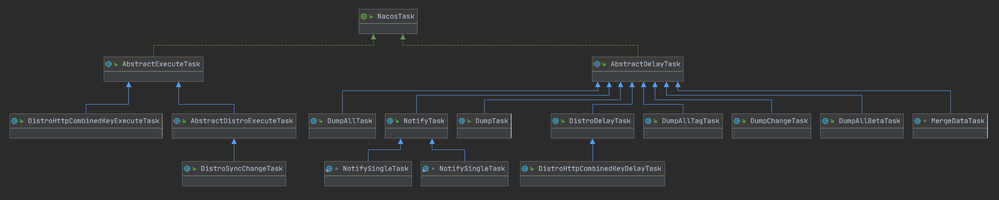

关于 Nacos 任务执行引擎的设计

// 任务的抽象.
public interface NacosTask {
    
    /**
     * Judge Whether this nacos task should do.
     *
     * @return true means the nacos task should be done, otherwise false
     */
    boolean shouldProcess();
}

NacosTask 分为两类，AbstractExecuteTask 和 AbstractDelayTask.

AbstractDelayTask 可以延迟和合并任务的抽象. 怎么理解了？可以看下 shouldProcess 方法，等于(当前时间-上次执行时间) >= 执行间隔，则允许执行.

AbstractExecuteTask 立即执行任务的抽象. 

// Nacos 任务执行引擎

public interface NacosTaskExecuteEngine<T extends NacosTask> extends Closeable {
    
    /**
     * Get Task size in execute engine.
     *
     * @return size of task
     */
    int size();
    
    /**
     * Whether the execute engine is empty.
     *
     * @return true if the execute engine has no task to do, otherwise false
     */
    boolean isEmpty();
    
    /**
     * Add task processor {@link NacosTaskProcessor} for execute engine.
     *
     * @param key           key of task
     * @param taskProcessor task processor
     */
    void addProcessor(Object key, NacosTaskProcessor taskProcessor);
    
    /**
     * Remove task processor {@link NacosTaskProcessor} form execute engine for key.
     *
     * @param key key of task
     */
    void removeProcessor(Object key);
    
    /**
     * Try to get {@link NacosTaskProcessor} by key, if non-exist, will return default processor.
     *
     * @param key key of task
     * @return task processor for task key or default processor if task processor for task key non-exist
     */
    NacosTaskProcessor getProcessor(Object key);
    
    /**
     * Get all processor key.
     *
     * @return collection of processors
     */
    Collection<Object> getAllProcessorKey();
    
    /**
     * Set default task processor. If do not find task processor by task key, use this default processor to process
     * task.
     *
     * @param defaultTaskProcessor default task processor
     */
    void setDefaultTaskProcessor(NacosTaskProcessor defaultTaskProcessor);
    
    /**
     * Add task into execute pool.
     *
     * @param key  key of task
     * @param task task
     */
    void addTask(Object key, T task);
    
    /**
     * Remove task.
     *
     * @param key key of task
     * @return nacos task
     */
    T removeTask(Object key);
    
    /**
     * Get all task keys.
     *
     * @return collection of task keys.
     */
    Collection<Object> getAllTaskKeys();
}

AbstractNacosTaskExecuteEngine 是对 NacosTaskExecuteEngine 的抽象实现，核心就是有一个 processor 的 map. 这个很好理解，引擎添加任务，交由 processor 来处理.

NacosExecuteTaskExecuteEngine 为 NacosExecuteTask 设计的引擎，需要注意的是有一个 TaskExecuteWorker，它的内部有一个线程和一个队列，这个线程一直从队列中获取任务执行(所以队列肯定是阻塞队列).TaskExecuteWorker 是为任务做兜底的，正常来说，任务都是交由 processor 来执行的.

NacosDelayTaskExecuteEngine 是为延时任务设计的引擎，这个类和 NacosExecuteTaskExecuteEngine 设计有些不同，NacosExecuteTaskExecuteEngine 中是没有队列的，而 NacosDelayTaskExecuteEngine 的设计中是有队列的. 并且是线程安全的. 如果任务执行失败，将会被重新放回队列中.

NacosDelayTaskExecuteEngine 的核心：

processingExecutor
                .scheduleWithFixedDelay(new ProcessRunnable(), processInterval, processInterval, TimeUnit.MILLISECONDS);

// 处理器.
public interface NacosTaskProcessor {
    
    /**
     * Process task.
     *
     * @param task     task.
     * @return process task result.
     */
    boolean process(NacosTask task);
}

以 DumpProcessor 进行说明：process 中执行的是业务逻辑.

总结来说，任务执行是三级结构：

Engine 存放 task 和 processor. 

说到这，再进一步，分析下任务执行和通知设计上的异同.

我理解的是通知模型，更加侧重的是实现发布订阅模式.

发布者包含订阅者集合和事件，在发布者中轮询事件. 同时这个模式可以衍生出监听者模式，即在 subscribe 中注册监听和通知.

NotifyCenter -> Publisher/Subscriber -> Listener.

那么通知和任务执行在设计上是否有共性了？

Engine -> task & processor

这两者在设计上，Engine 功能和 Publisher 差不多，processor 和 subscriber 差不多，task 和 event 差不多.

那么能否将这两种设计整合在一起了？

我觉得是可以进行整合的.